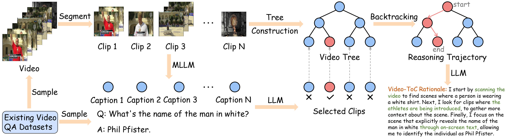

# Video-ToC: Video Tree-of-Cue Reasoning

[📖 Paper](https://arxiv.org/abs/2604.20473)



> **Abstract**: *Existing Video Large Language Models (Video LLMs) struggle with complex video understanding, exhibiting limited reasoning capabilities and potential hallucinations. In particular, these methods tend to perform reasoning solely relying on the pretrained inherent reasoning rationales whilst lacking perception-aware adaptation to the input video content. To address this, we propose \textbf{Video-ToC}, a novel video reasoning framework that enhances video understanding through tree-of-cue reasoning. Specifically, our approach introduces three key innovations: (1) A tree-guided visual cue localization mechanism, which endows the model with enhanced fine-grained perceptual capabilities through structured reasoning patterns; (2) A reasoning-demand reward mechanism, which dynamically adjusts the reward value for reinforcement learning (RL) based on the estimation of reasoning demands, enabling on-demand incentives for more effective reasoning strategies; and (3) An automated annotation pipeline that constructs the Video-ToC-SFT-1k and Video-ToC-RL-2k datasets for supervised fine-tuning (SFT) and RL training, respectively. Extensive evaluations on six video understanding benchmarks and a video hallucination benchmark demonstrate the superiority of Video-ToC over baselines and recent methods.*

The SFT part is based on [LlamaFactory](https://github.com/hiyouga/LlamaFactory), the RL part is based on [EasyR1](https://github.com/hiyouga/EasyR1), and the eval part is based on [Video-R1](https://github.com/tulerfeng/Video-R1). Thanks for their awesome work!

## Installation

```
conda create -n Video-ToC python=3.11 -y
conda activate Video-ToC
./install.sh
```

## Data Preparation

1. Use `./download.sh` to download Qwen2.5-VL-7B-Instruct and six datasets.
2. Unzip these dataset and place the videos into the corresponding folders according to the `"path"` specified in the `Evaluation/eval_*.json` files.
3. Download training [videos](https://huggingface.co/datasets/Albertzz888/Video-ToC) (a subset from [LLaVA-Video-178K](https://huggingface.co/datasets/lmms-lab/LLaVA-Video-178K)) into the `data/video` folder.

## Train & Eval

Simply use `./sft.sh` for SFT, `./grpo.sh` for RL, and `./eval.sh` for evaluation.

## Citation

```
@article{tan2026video,
  title={Video-ToC: Video Tree-of-Cue Reasoning},
  author={Tan, Qizhong and Tian, Zhuotao and Lu, Guangming and Yu, Jun and Pei, Wenjie},
  journal={arXiv preprint arXiv:2604.20473},
  year={2026}
}
```